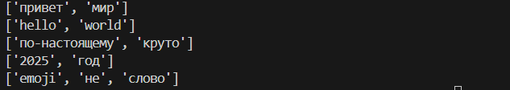

# ДЗ (lab06)

### Задание A — модуль src/lab06/cli_text.py


---

### Задание B – src/lab06/cli_convert.py


# ДЗ (lab05)

### Задание A — модуль src/lab05/csv_json.py


---
### Задание B – src/lab05/csv_xlsx.py


# ДЗ (lab04)

### Задание A — модуль src/lab04/io_txt_csv.py


---

### Задание B – src/lab04/text_report.py


# ДЗ (lab03)

### Задание A normalize

```py
def normalize(text, casefold, repe):
    new_text = text.replace(r'\n',' ').replace(r'\t', ' ').replace(r'\r', ' ')
    if casefold == True:
        new_text = new_text.casefold()
    if repe == True:
        new_text = new_text.replace('Ё','Е').replace('ё', 'е')
    new_text = ' '.join(new_text.split())
    return new_text
```


---

### Задание A token

```py
def token(text):
    lst = [x for x in text]
    for index in range(len(lst)):
        if (lst[index].isdigit() or lst[index].islower() or lst[index] in [' ','-','_']) == 0:
            lst[index] = ' '
    answer = [x.strip('-') for x in ''.join(lst).split() if x != '-']
    return answer
```



### Задание A count_freq

```py
def count_freq(tokens):
    counts = dict()
    for i in set(tokens):
        counts[i] = tokens.count(i)
    return counts
```


---

### Задание A  top_freq

```py
def top_freq(counts, kol):
    direct = counts.items()
    maxi = max(list(counts.values()))
    answer = []
    if kol > len(direct):
        kol = len(direct)
    while kol > 0:
        answer = answer + sorted([x for x in direct if x[1] == maxi])[0: kol]
        kol = kol - len(sorted([x[0] for x in direct if x[1] == maxi])[0: kol])
        maxi -= 1
    return answer
```


---

### Задание B
```py
import ex301 
text = ex301.normalize(input(), 1, 1)
print(f'Всего слов: {len(ex301.token(text))}')
print(f'Уникальных слов: {len(set(ex301.token(text)))}')
print('Топ-5:')
for i in ex301.top_freq(ex301.count_freq(ex301.token(text)), 3):
    print(i)
```


# ДЗ (lab02)

### Задание A

```py
def min_max(nums):
    return (min(nums), max(nums)) if len(nums) > 0 else 'ValueError'

def unique_sorted(nums):
    return sorted(list(set(nums)))

def flatten(matrix):
    inermatrix = []
    for element in matrix:
        if isinstance(element, tuple) or isinstance(element, list):
            for num in element:
                inermatrix.append(num)
        else:
            return "TypeError"
    return inermatrix
```


---

### Задание B transpose()

```py
def transpose(matrix):
    inermatrix = []
    if len([x for x in matrix if len(x) == len(max(matrix, key = len))]) == len(matrix):
        if len(matrix) == 1:
            for element in matrix[0]:
                inermatrix.append([element])
            return inermatrix
        elif len(matrix) == 0:
            return matrix
        else:
            for index in range(len(matrix[0])):
                inermatrix.append([element[index] for element in matrix])
            return inermatrix   
    else:
        return "ValueError"
```


### Задание B row_sums()

```py
def row_sums(matrix):
    sums = []
    if len([x for x in matrix if len(x) == len(max(matrix, key = len))]) == len(matrix):
        for element in matrix:
            sums.append(sum(element))
        return sums
    else:
        return "ValueError"
```


---

### Задание B  col_sums()

```py
def col_sums(matrix):
    if len([x for x in matrix if len(x) == len(max(matrix, key = len))]) == len(matrix):
        sums = []
        for index in range(len(matrix[0])):
            sums.append(sum([element[index] for element in matrix]))
        return sums
    else:
        return 'ValueError'
```


---

### Задание C
```py
def format_record(write):
    answer = ''
    if len(write[0]) == 0:
        return "ValueError"
    else:
        newfio = write[0].split()
        answer += newfio[0][0].upper() + newfio[0][1: ] + ' '
        for initial in newfio[1:]:
            answer += initial[0].upper() + '.'
    answer += ', гр. '
    if len(write[1]) == 0:
        return "ValueError"
    else:
        answer += write[1] + ', '
    if 0 <= write[2] <= 5.0:
        answer += f'GPA {format(write[2], '.2f')}'
    else:
        return "ValueError"
    return answer
```


# ДЗ за 10.09.2025 (lab01)

### Задание 1 — Привет и возраст

```py
name = input()
age = int(input())
print(f"Привет, {name}! Через год тебе будет {age + 1}.")
```


---

### Задание 2 — Сумма и среднее

```py
a = float(input())
b = float(input())
print(f"sum={a + b}", f"avg={format((a + b) / 2, '.2f')}")
```


### Задание 3 — Чек: скидка и НДС

```py
discount = float(input())
vat = float(input())
base = price * (1 - discount/100)
vat_amount = base * (vat/100)
total = base + vat_amount
print(f"База после скидки: {format(base,'.2f')} ₽" ,f"НДС:               {format(vat_amount,'.2f')} ₽", \
      f"Итого к оплате:    {format(total,'.2f')} ₽", sep='\n')
```


---

### Задание 4 — Минуты → ЧЧ:ММ

```py
minute = int(input())
print(f"{minute // 60 % 24}:{minute % 60}")
```


---

### Задание 5 — Инициалы и длина строки
```py
s = input().strip()
fio = s.split()
while '  ' in s:
    s = s.replace('  ','')
print(fio[0][0], fio[1][0], fio[2][0], '.', sep='')
print(f'Длина строки: {len(s)}')
```


---

### Задание 6
```py
kol = int(input())
k1 = 0
k2 = 0
for _ in range(kol):
    data = input().split()
    if data[3] == "True":
        k1 += 1
    else:
        k2 += 1
print(k1, k2)
```


---


