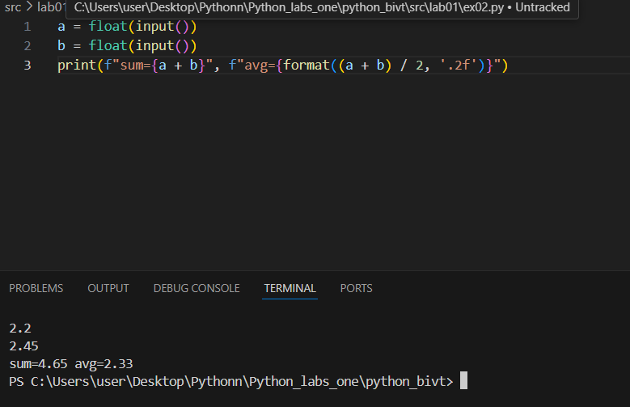
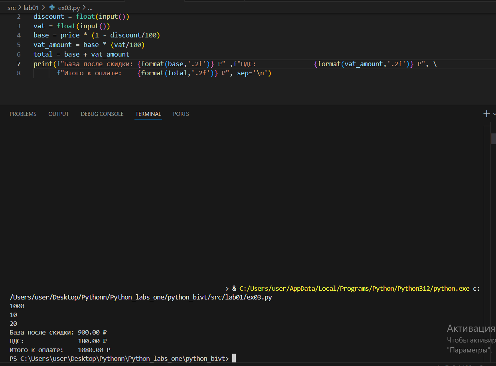
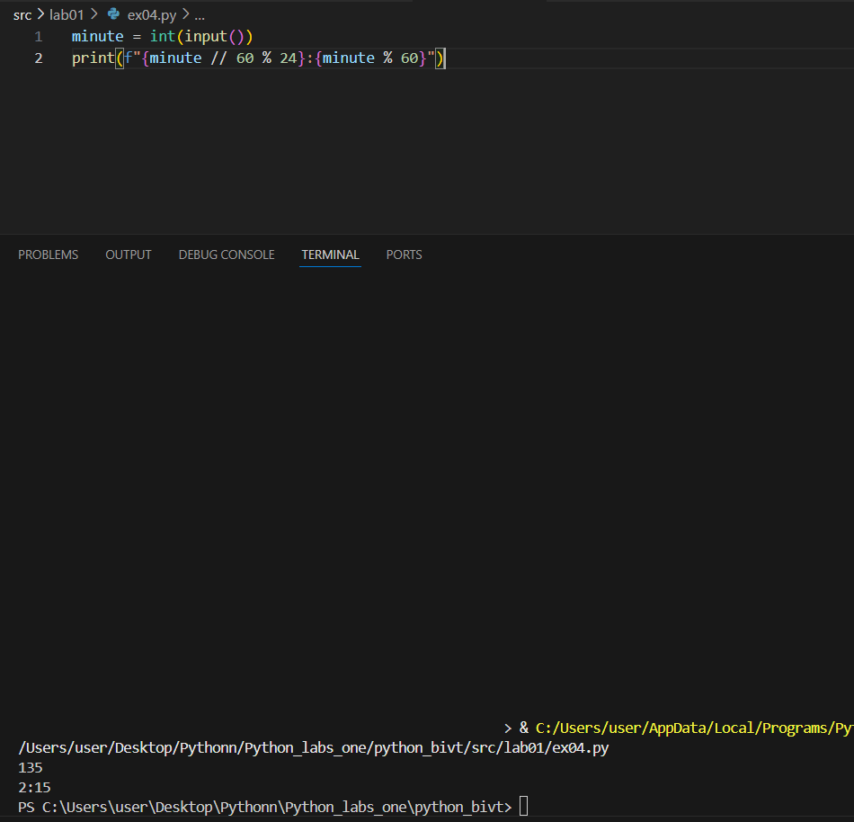
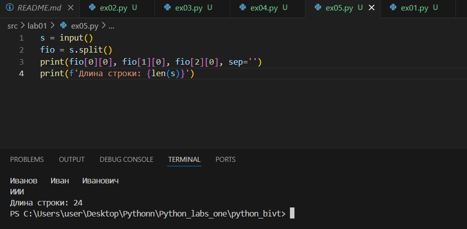
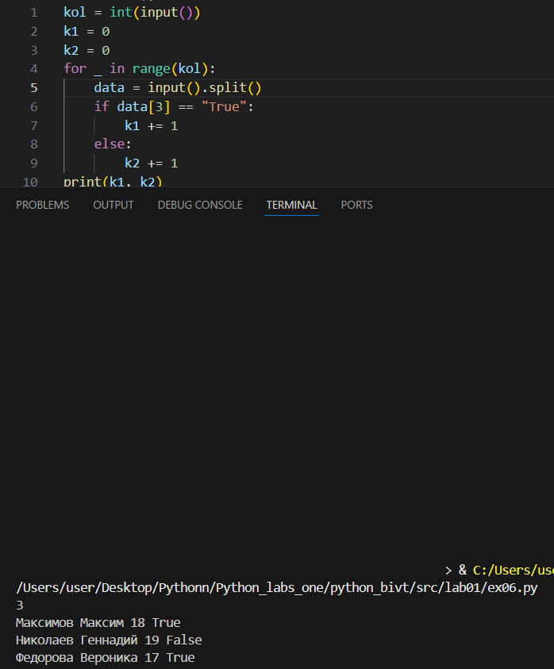

# ДЗ за 10.09.2025 (lab01)

### Задание 1 — Привет и возраст

```py
name = input()
age = int(input())
print(f"Привет, {name}! Через год тебе будет {age + 1}.")
```


---

### Задание 2 — Сумма и среднее

```py
a = float(input())
b = float(input())
print(f"sum={a + b}", f"avg={format((a + b) / 2, '.2f')}")
---



### Задание 3 — Чек: скидка и НДС

```py
discount = float(input())
vat = float(input())
base = price * (1 - discount/100)
vat_amount = base * (vat/100)
total = base + vat_amount
print(f"База после скидки: {format(base,'.2f')} ₽" ,f"НДС:               {format(vat_amount,'.2f')} ₽", \
      f"Итого к оплате:    {format(total,'.2f')} ₽", sep='\n')



---

### Задание 4 — Минуты → ЧЧ:ММ

```py
minute = int(input())
print(f"{minute // 60 % 24}:{minute % 60}")
```



---

### Задание 5 — Инициалы и длина строки
```py
s = input()
fio = s.split()
print(fio[0][0], fio[1][0], fio[2][0], sep='')
print(f'Длина строки: {len(s)}')

```



---

### Задание 6
```py
kol = int(input())
k1 = 0
k2 = 0
for _ in range(kol):
    data = input().split()
    if data[3] == "True":
        k1 += 1
    else:
        k2 += 1
print(k1, k2)

```



---


